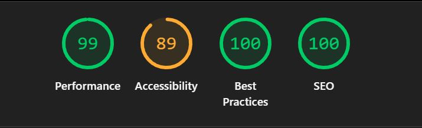

# 🎨 Pure Art – 3D & Motion Portfolio Website

A high-performance portfolio website showcasing **3D visualization, motion design, and interactive WebGL demos** – built entirely with **HTML, CSS, and vanilla JavaScript**.  
The project was a personal challenge to keep the site **lightning fast** despite being filled with **images, videos, and interactive 3D content**.

---

## 🌐 Live Demo  
🔗 [View Website](https://www.pure-art.co/)
🎨 [Behance Portfolio](https://www.behance.net/pure-art)

---

## ✨ Features  

- 🌍 **Responsive Design** – optimized for desktop, tablet, and mobile.  
- ⚡ **High Performance** – Lighthouse score **99** with heavy media content.  
- 🧩 **Dynamic Header & Footer** – injected across all pages for maintainability.  
- 🎥 **Image & Video Galleries** – modal/lightbox with autoplay video support.  
- 🔄 **Mosaic Randomizer** – dynamic gallery images changing every 2s.  
- 🚗 **CarJsShowcase Integration** – interactive 3D car demo built with Three.js.  
- 🛠 **SEO 100 & Best Practices 100** – fully optimized structure and metadata.  

---

## 🛠 Tech Stack  

**Frontend**  
- HTML5  
- CSS3 (Flexbox, Grid, Variables, Responsive Media Queries)  

**JavaScript**  
- Vanilla JS (Modal, Video Player, Randomizer, Dynamic Year Injection)  

**3D & Interactive**  
- Three.js (CarJsShowcase integration)  

**Optimization**  
- WebP images & lazy loading  
- SEO metadata & semantic HTML  

**Analytics**  
- Google Tag Manager  

---

## 📂 Architecture Highlights  

- **Component-based structure** → header and footer injected dynamically with `fetch()` → single source of truth.  
- **Unified modal system** → handles both images and videos with autoplay/unmute logic.  
- **Organized file structure**  
pages → subpages (Exterior, Interior, Product, Film, 360, Other, Contact)
/assets/img → optimized images + thumbnails
/assets/video → compressed MP4 videos
/components → reusable header/footer
main.js → modal, randomizer, GA, footer year
styles.css → variables, layouts, responsive rules

---

## 📊 Lighthouse Results  

- **Performance:** 99  
- **Accessibility:** 89  
- **Best Practices:** 100  
- **SEO:** 100  

 
---

## 🎯 What I Learned  

- How to **balance rich media content with high performance**.  
- Writing **scalable, maintainable vanilla JS**.  
- Applying **responsive & accessible design principles**.  
- Combining **3D visualization skills with frontend development**.  
- Importance of SEO, metadata, and performance optimization.  

---

## 🔗 Links  

- 🌍 [Live Demo](https://www.pure-art.co/)
- 🎨 [Behance Portfolio](https://www.behance.net/pure-art)  
- 💼 [LinkedIn Profile](https://www.linkedin.com/in/nour-tinawi)  

---
